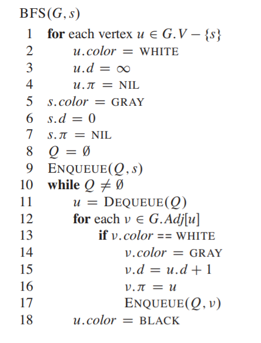
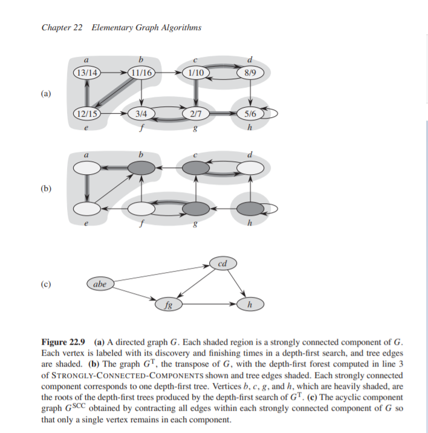

# 22. Elementary Graph Algorithms.  
This chapter presents methods for representing a graph and for seraching a graph.  
Because, it is something we learnt before, I will not go through details in this chapters.  
## 22.1. Representations of graphs.  
We can choose between two standard ways to represent a graph G = (V,E).  
+ as a collection of adjacency lists.  
+ adjacency matrix.  
Because the adjacency-list provides a compact way to represent **sparse** graph, it is the most prevalent method today.  
## 22.2. Breadth-first search.  
**Breadth-first search** is one of the simplest algorithms for searching a graph and  the archetype for many important algorithms. Because, it reaches nodes as their "levels" increases, BFS often used in finding shortest path.  
Source code:

.  

## 22.3. Depth-first search.  
Different with BFS, the strategy in DFS is, to search deeper in the graph whenever possible.  
DFS in finding bridges.  
```
int low[N], num[N];
vector < vector<int> > G;
bool ok[N];
int khop, cau, n, m;
void dfs(int u,int pre){
    low[u] = num[u] = ++cnt;
    int chid = 0;
    for(int i=0;i<G[u].size();++i){ int v = G[u][i]; if (v == pre) continue;
        if (num[v]) low[u] = min(low[u], num[v]);
            else {
                chid++;
                dfs(v,u); low[u] = min(low[u], low[v]);
                if (low[v] >= num[v])  cau++;
                if (low[v] >= num[u] && u != pre) ok[u] = 1; 
            }
        }
        if (u == pre && chid >= 2) ok[u] = 1;
    }
```  

## 22.4. Topological sort.  
This section shows how we can use DFS to perform a topological sort of a directed acyclic graph, or a "DAG" as it is sometimes called. A **topological sort** of a a dag G = (V,E) is a linear ordering of all its vertices such that if G contains a edge (u,v) then u appears before v in the ordering. (If graph contain a cycle then no linear ordering is possible).  
We can perform **topological sort** in a simple algorithm using DFS.  
```
TOPOLOGICAL_SORT(G):
call DFS(G) to compute finishing times v.f for each vertex v.  
as each vertex is finished, insert it onto the front of a linked list.  
return the linked list of vertices.  
```  
We can perform this algorithm in O(|V| + |E|).  
It is worth to notice that a directed graph G is acyclic if and only if a DFS search of yields no backs edges.  
**Note:** We also perform an BFS or Djikstra-like algorithm to find Toposort. For example, in Kahn's algorithm, his goal is finding the "start nodes" - a node s which have no incomming edges and insert them into answer set, and delete node s.  
Below is my code for [TOPOSORT](https://www.spoj.com/problems/TOPOSORT/) problem to find smallest topological sort order. It works well with priority_queue to find the answer.  
```
void solve(){
	priority_queue< pr, vector<pr>, greater<pr> > pq;
	for(int i=1;i<=n;++i) pq.push(pr(d[i],i));
	while (pq.size()){
		pr u = pq.top(); pq.pop();
		if (d[u.second] != u.first) continue;
		if (!u.first) {
			topo.push_back(u.second);
			for(auto v : G[u.second]){
				d[v]--;
				pq.push(pr(d[v],v));
			}
		}
	}
	if (topo.size() != n) cout << "Sandro fails.";
	else {
		for(auto v: topo) cout << v << ' ';
	}
}
```  
[**Source code**](./TOPOSORT.cpp)
## 22.5 Strongly connected components.  
We now consider a classic application of deph-first search: decomposing a directed graph into its strongly connected components.  
Recall prom Appendix B that a strongly connected component of a directed graph G = (V,E) is a maximal set of vertices $C \in V$ such that for every pair of vertices u and v in C, we have both the roads from u to v, and from v to u. Figure 22.9 shows an example.  

  

**Note:** Instead of showing the original algorithms for finding Strongly connected components in Introduction to Algorithm, I will recommend about Tarjan algorithm for finding strongly connected components.  
```
void dfs(int u,int pre){
    visted_node.push_back(u);
    low[u] = num[u] = ++cnt;
    for(int i=0;i<G[u].size();++i){int v = G[u][i]; if (v == pre) continue;
        if (num[v]) low[u] = min(low[u], num[v]);
            else {
                dfs(v,u); low[u] = min(low[u], low[v]);
            }
    }
    if (low[u] == num[u]){
        scc++;
        while (visted_node.back() != u){
            low[visted_node.back()] = num[visted_node.back()] = INF;
            visted_node.pop_back();
        }
        low[u] = num[ad.back()] = INF;  ad.pop_back();
    }
}
```  
In this source code, during DFS, I maintain two variables for each node u: low[u] and num[u].  
+ num[u]: is the order of nodes in which the order they are discovered in the dfs.  
+ low[u]: represents the smallest index of any node known to be reachable from u through u's DFS subtree, including v itself.  
If u is the root of an SCC(strongly connected components) then low[u] must equal to u.  
+ Besides, visited_node is an vector/ stack to maintain all the visited node according to DFS order.
``` 
  while (visted_node.back() != u){
            low[visted_node.back()] = num[visted_node.back()] = INF;
            visted_node.pop_back();
        }
        low[u] = num[ad.back()] = INF;  ad.pop_back();
```  
When you find a scc and its root (node u), you need to remove the scc connected from the graph by assigning low[v] = num[v] = INF for each member of this strongly connected components.  
You can submit the code in [here](https://vn.spoj.com/problems/TJALG/)  
[**Source code**](./TARJAN.cpp)  
Also, you can use Tarjan algorithm to find all of the bridges and joints in a graph.  
A bridge is a edge (u,v) that if you remove it, the number of strongly connected components will be increased.  
Similarly, a joint is a node that if you remove it, the number of strongly connected components will be increased.  
```
void dfs(int u,int pre){
    low[u] = num[u] = ++cnt;
    int chid = 0;
    for(int i=0;i<G[u].size();++i){ int v = G[u][i]; if (v == pre) continue;
        if (num[v]) low[u] = min(low[u], num[v]);
            else {
                chid++;
                dfs(v,u); low[u] = min(low[u], low[v]);
                if (low[v] >= num[v])  cau++;
                if (low[v] >= num[u] && u != pre) ok[u] = 1; 
            }
        }
        if (u == pre && chid >= 2) ok[u] = 1;
    }
```
In the above code, I maintain ok[u] to check that if node u is a joint or not.  
An edge (u,v) (u is the father in DFS order) is a bridge if and only if (low[v] >= num[u]) it means that if you try to delete edge (u,v), then node v cannot connect with the node u anymore (because it cannot reach to the node which is discovered before u).  
Similarly, a node u is a joint, if:
+ It is the root of the tree and have at least two child.  
+ or It has at least one node v, and edge (u,v) is a bridge.  

You can submit your code [here](https://vn.spoj.com/problems/GRAPH_/)  

[**Source code**](./GRAPH.cpp)  

## LCA(Lowest Common Ancestor)  
Source code:
```
int lca(int u,int v){
    if (level[u] < level[v]) swap(u,v);
    for(int i=logN-1;i>=0;--i) if (level[u] - (1 << i) >= level[v]) u = par[u][i];
    if (u == v) return u;
    for(int i=logN-1;i>=0;--i) if (par[u][i] != -1 && par[u][i] != par[v][i]) u = par[u][i], v = par[v][i];
    return par[u][0];
}
void prep(int u,int preU){
    par[u][0] = preU;
    if (preU != -1) level[u] = level[preU] + 1;
    for (auto node : G[u]){ 
        if (node.adj == preU) continue;
        prep(node.adj, u);
    }
}
```
 


